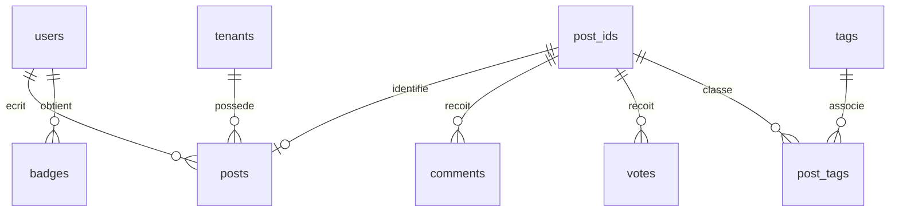

# Moteur de recherche Coffee Stack Exchange

## Organisation des données

`users` contient les auteurs. `post_ids` fournit une identité globale à chaque post. `posts` contient les questions et les réponses, partitionnées par année de création. `comments`, `votes` et `post_tags` référencent cette identité. `tags` décrit les tags et `badges` les distinctions des utilisateurs.

La clé primaire de `posts` est `(id, creation_date)`. PostgreSQL exige que la clé d'une table partitionnée couvre la clé de partitionnement. La table `post_ids`, avec un `id` unique et une clé `(id, creation_date)`, évite qu'un même identifiant de post apparaisse dans deux années. Voir [les contraintes du partitionnement](https://www.postgresql.org/docs/16/ddl-partitioning.html).



Le LAB 4.7 renomme les votes importés en `votes_old`, puis les migre dans `votes`, partitionnée par mois. Les douze partitions de 2023 s'accompagnent d'une partition par défaut pour conserver les autres années. Un filtre de juin 2023 montre l'élagage des partitions dans le journal du projet. `votes_old` sert au contrôle de migration.

## Recherche et index

Un trigger construit `search_vector` à chaque modification du titre, du corps ou des métadonnées. Le titre reçoit le poids A et le corps le poids B. La langue vient de `metadata.language` : anglais, français, allemand ou espagnol. Une langue inconnue utilise l'anglais. Il n'y a pas de détection automatique de langue.

La recherche garde d'abord les correspondances FTS. S'il y en a moins de cinq, elle complète avec la similarité trigramme du titre. Les correspondances exactes passent en premier. Le rang combine la pertinence textuelle, le score, les vues et l'âge du post. L'identifiant départage les égalités pour stabiliser les pages.

| Index | Rôle |
|---|---|
| GIN sur `search_vector` | Recherche des lexèmes contenus dans les documents |
| GiST trigramme sur `title` | Recherche approchée et tolérance aux fautes |
| GIN sur `metadata` | Filtrage par inclusion JSONB |
| B-tree sur type/date, auteur et score | Restrictions et jointures courantes |
| Index sur commentaires/post et votes/post/type | Comptages associés aux résultats |
| BRIN sur la date de création | Démonstration adaptée aux données ordonnées par date |

GIN est le choix recommandé pour le FTS par [PostgreSQL](https://www.postgresql.org/docs/16/textsearch-indexes.html). Les opérateurs de similarité et leurs index sont décrits dans [pg_trgm](https://www.postgresql.org/docs/16/pgtrgm.html). Ces index n'obligent pas le planificateur à les utiliser : un parcours séquentiel peut coûter moins cher sur le petit dump Coffee.

```sql
SELECT * FROM advanced_search('espresso grinder');
SELECT * FROM smart_search('espressso');
SELECT * FROM advanced_search('coffee',
  '{"tags":["espresso"],"min_score":1,"has_accepted_answer":true,
    "date_range":{"from":"2020-01-01","to":"2024-12-31"}}', 1, 10);
SELECT * FROM advanced_search('cheval', '{"language":"fr"}');
SELECT * FROM get_search_suggestions('cof', 5);
```

La démonstration française ajoute temporairement des posts en français dans les tests, car le dump Coffee est anglophone. `date_from` et `date_to` sont aussi acceptés, conformément aux exemples du projet. La borne de fin inclut toute la journée. Les tags sont combinés par **ET**. Les filtres inconnus ou mal typés sont refusés. `metadata` accepte un objet à retrouver avec l'opérateur `@>`.

`search_posts(texte, page, taille)` expose l'interface du LAB 2.8 avec le même moteur, le ranking, la langue de session et la journalisation. La langue peut aussi être fixée par `SET app.search_language = 'fr'`. `faceted_search(filtres)` permet de tester les filtres sans recherche textuelle.

## Droits d'accès et cache

Les fonctions de recherche utilisent les droits de l'appelant. Les tests changent effectivement de rôle avec `SET ROLE`, car un superutilisateur contourne RLS. Voir [le comportement de RLS](https://www.postgresql.org/docs/16/ddl-rowsecurity.html).

| Rôle | Posts accessibles |
|---|---|
| `tenant_reader` | Publics de son tenant et ses propres posts privés |
| `tenant_moderator` | Tous les posts de son tenant, dont ceux en modération |
| `lab_admin` | Tous les tenants |

Les variables de session `app.current_tenant_id` et `app.current_user_id` simulent un contexte applicatif. Dans une application réelle, le serveur doit les établir après authentification, dans la transaction de chaque requête. Ce TP n'expose pas de connexion SQL à un utilisateur final. Les tables de partitions ne sont pas directement accessibles au rôle lecteur.

La clé du cache inclut le rôle, le tenant, l'utilisateur applicatif, la langue, les filtres et la pagination. Les suggestions et les journaux sont eux aussi séparés par contexte. Une modification de post, de ses tags ou du nom d'un tag invalide le cache. Le TTL est de cinq minutes. La seule fonction `SECURITY DEFINER` vide le cache, avec un `search_path` fixe et sans droit d'appel public.

`pgcrypto` chiffre une valeur de profil dans `user_secrets`. Une clé aléatoire de démonstration reste en session et n'est pas conservée. Le déchiffrement est vérifié pendant l'installation. Cette illustration ne constitue pas un système de gestion de clés de production. Les vues matérialisées globales sont réservées à l'administrateur.

## Automatisation et analytique

`check_and_award_badges` attribue Scholar, Supporter, Critic, Nice Answer et Popular Question sans réattribuer le même badge. Les triggers couvrent l'insertion et la modification d'un vote. Accepter une réponse vérifie les badges de son auteur, même si c'est la question qui a changé. Un verrou transactionnel par utilisateur sérialise les attributions. Les compteurs de réponses suivent l'ajout, le déplacement et la suppression d'une réponse.

`get_dashboard_metrics()` calcule les métriques de recherche de la session. `get_trending_tags()` agrège les tags des posts récents. `get_rising_questions()` classe les questions d'après leurs votes positifs récents, pour l'administrateur. Les plages longues servent uniquement à parcourir le dump historique.

`dashboard_posts` associe les posts au CSV enrichi lu par `file_fdw`. `post_stats` simule explicitement une source de statistiques distante, comme autorisé dans l'énoncé. Ces statistiques de visite sont synthétiques. `search_analytics` agrège les recherches par heure. Pour actualiser les vues :

```sql
REFRESH MATERIALIZED VIEW dashboard_posts;
REFRESH MATERIALIZED VIEW search_analytics;
SELECT get_dashboard_metrics();
SELECT * FROM get_trending_tags(INTERVAL '10 years');
SELECT * FROM get_rising_questions(INTERVAL '10 years');
```

## Limites du TP

Le dump contient quelques milliers de posts. Le partitionnement illustre le mécanisme et ne prouve aucun gain à l'échelle de millions de lignes. Les benchmarks sont séquentiels et locaux. Les extraits marqués avec `<b>` nécessiteraient un rendu HTML assaini dans une interface web. Les mots de passe fictifs de BlogApp sont des données d'exercice, pas une implémentation d'authentification.
